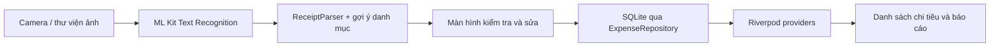

# VKU Expense OCR

Ứng dụng Flutter quản lý chi tiêu cá nhân bằng cách quét ảnh hóa đơn. Ứng dụng chạy OCR trên thiết bị, cho người dùng kiểm tra và sửa thông tin trước khi lưu vào SQLite; dữ liệu vẫn dùng được khi offline.

## Luồng chính



## Tính năng

- Chụp ảnh hoặc chọn ảnh hóa đơn; OCR xử lý cục bộ bằng ML Kit.
- Tự đọc cửa hàng/người nhận, số tiền, ngày và gợi ý danh mục; người dùng xem, sửa rồi mới lưu.
- Cảnh báo khả năng trùng theo ngày, số tiền và tên/OCR; vẫn cho phép xác nhận lưu nếu hai giao dịch hợp lệ giống nhau.
- Xem, lọc danh mục, mở chi tiết, sửa và xóa khoản chi.
- Báo cáo tháng: tổng theo danh mục, so sánh chi tiêu theo tuần trong tháng, biểu đồ 7 ngày, ngân sách và nhận xét.
- SQLite offline, Riverpod quản lý trạng thái, Material 3 với sáng/tối và bố cục co giãn.

## Yêu cầu và chạy ứng dụng

- Flutter/Dart theo phiên bản SDK trong `pubspec.yaml`.
- Android Studio/Android SDK cho Android; Xcode trên macOS cho iOS.

```sh
flutter pub get
flutter run
```

Mở `lib/main.dart` trong Android Studio cũng có thể chạy trên thiết bị Android. Để OCR đáng tin cậy, dùng ảnh rõ, đủ sáng và chụp trọn hóa đơn. OCR chỉ đưa ra dữ liệu gợi ý; hãy kiểm tra số tiền, ngày và người nhận trước khi lưu.

## Kiểm tra chất lượng

```sh
dart format lib test
flutter analyze
flutter test
```

Các test bao phủ parser, gợi ý danh mục, insights, định dạng tiền/ngày, CRUD và phát hiện trùng của repository, migration SQLite, cùng card chi tiêu ở cả theme sáng/tối. Repository test dùng SQLite FFI trong bộ nhớ.

## Build Android

Build APK để cài thử:

```sh
flutter build apk --debug
```

APK debug nằm trong `build/app/outputs/flutter-apk/`. Để phát hành, tạo keystore cá nhân và cấu hình `android/key.properties` theo `android/key.properties.example`; không commit keystore hay mật khẩu. Sau đó build bằng `flutter build apk --release` và lưu trữ bản ký số an toàn. Xem [kịch bản demo](docs/DEMO_SCRIPT.md) và [báo cáo mini-project](docs/REPORT.md) để chuẩn bị bàn giao.

## Giới hạn hiện tại

- OCR là heuristic và phụ thuộc chất lượng ảnh/ngân hàng/định dạng hóa đơn; luôn cần người dùng xác minh.
- Dữ liệu chỉ lưu trên thiết bị; phiên bản này chưa có sao lưu cloud hoặc đồng bộ nhiều thiết bị.
- APK ký phát hành và video demo là đầu ra cần tạo trên máy người phát triển sau khi cấu hình keystore và kiểm tra trên thiết bị thật.
