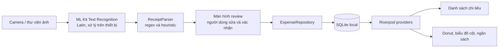

# Báo cáo tóm tắt Mini-Project 3

## VKU Expense OCR — Connecting the System Pipeline

**Sinh viên:** [Điền họ tên]  
**Môn học/lớp:** [Điền thông tin nếu biểu mẫu yêu cầu]  
**Nền tảng:** Flutter/Dart, Android  
**Ngày báo cáo:** 08/10/2026

## Tóm tắt

VKU Expense OCR là ứng dụng Android hỗ trợ quản lý chi tiêu từ ảnh hóa đơn. Người dùng chụp ảnh bằng camera hoặc chọn ảnh có sẵn; ML Kit nhận diện văn bản trên thiết bị, bộ phân tích quy tắc trích xuất thông tin, rồi đưa kết quả tới màn hình xác nhận. Người dùng có thể sửa tên cửa hàng/người nhận, số tiền, ngày và danh mục trước khi lưu. Các khoản đã xác nhận được lưu cục bộ bằng SQLite và dùng để cập nhật danh sách cũng như báo cáo.

Ứng dụng đã được build dưới dạng APK release ký bằng keystore của người phát triển, chạy trên điện thoại Android thật và đã quay video demo theo thông tin của người thực hiện. Bộ kiểm tra tự động gồm 29 test; `flutter analyze` đã hoàn tất không có vấn đề phân tích tại lần kiểm tra gần nhất.

## 1. Kiến trúc pipeline

> Mã nguồn được chia theo `core/` (theme và tiện ích), `data/` (model, OCR, SQLite/repository) và `features/` (màn hình, widget, provider theo tính năng). Riverpod chuyển trạng thái giữa giao diện và tầng dữ liệu. OCR mặc định nhận diện chữ Latin; ảnh và nội dung hóa đơn không được gửi lên dịch vụ AI đám mây.

## 2. Nhận diện và kiểm tra hóa đơn

ML Kit trả về văn bản OCR thô. `ReceiptParser` dùng biểu thức chính quy và heuristic để tạo dữ liệu gợi ý. Trọng số confidence hiện tại là 0,3 cho tên, 0,3 cho ngày, 0,4 cho số tiền có nhãn; số tiền fallback chỉ cộng 0,1. Đây là điểm hỗ trợ review, không phải xác suất được hiệu chuẩn.

| Trường hợp | Quy tắc chính | Mục đích |
|---|---|---|
| Ngày | `\b(\d{1,2})[-/](\d{1,2})[-/](\d{2,4})\b` | Đọc dạng ngày/tháng/năm có dấu `/` hoặc `-`; năm hai chữ số được hiểu là năm 2000 trở đi. |
| Số tiền | `\d+(?:[.,]\d+)*` | Lấy các cụm số có dấu phân nhóm; chuẩn hóa dạng `1.000.000`, `1,000,000` và dạng thập phân phổ biến. |
| Từ khóa tiền | `tong cong`, `total`, `thanh toan`, `thanh tien`, `so tien`, `amount`, `paid` | Ưu tiên số trên dòng có nhãn tổng/thanh toán. |
| Đơn vị tiền | `\bVND\b`, `VNĐ`, `₫`, `đồng`, `đ` | Nhận diện dòng tiền tệ, thường gặp trên biên lai chuyển khoản. |
| Loại dòng không phải tiền | `tai khoan`, `stk`, `account`, `phone`, `hotline`, `ma giao dich`, `reference`… | Loại số tài khoản, số điện thoại và mã giao dịch khỏi bước fallback. |
| Tên người nhận chuyển khoản | Phát hiện tiêu đề `chuy.n\s+ti.n\s+th.nh\s+c.ng`; sau ngày/giờ tìm dòng tên 2–5 từ, không có chữ số | Ưu tiên người nhận như tên cửa hàng khi biên lai là giao dịch chuyển khoản. |

Với biên lai chuyển khoản, parser tìm người nhận ở gần phần ngày/giờ thay vì dùng dòng trạng thái “Chuyển tiền thành công”. Với số tiền fallback, số nguyên không phân nhóm từ 8 chữ số trở lên bị loại để giảm nhầm với tài khoản. Nếu không tìm thấy ngày, parser dùng ngày hiện tại làm giá trị gợi ý. Vì hóa đơn có nhiều mẫu và OCR có thể nhiễu, màn hình review là bước bắt buộc trước khi lưu.

Danh mục được gợi ý offline bằng từ khóa tên như quán ăn/cafe, Grab/taxi, siêu thị và nhà mạng/tiện ích. Người dùng vẫn có thể chọn lại danh mục.

## 3. Lưu trữ, báo cáo và trải nghiệm

SQLite lưu tên, số tiền, danh mục, ngày, đường dẫn ảnh tùy chọn, văn bản OCR gốc, cờ xác minh và thời điểm tạo. `ExpenseRepository` hỗ trợ CRUD, tổng tháng/danh mục, số liệu tuần và 7 ngày. Khi lưu, cảnh báo trùng dùng ngày, số tiền, tên hoặc văn bản OCR; người dùng có thể tiếp tục nếu đó là giao dịch hợp lệ giống nhau. Migration schema v2 bổ sung index theo ngày và danh mục/ngày, giữ dữ liệu cũ.

Trang báo cáo có chọn tháng, biểu đồ donut phân bổ danh mục, gauge ngân sách, biểu đồ tuần trong tháng, biểu đồ 7 ngày và nhận xét chi tiêu. Donut và cột được vẽ bằng `CustomPainter`, có animation; người dùng có thể chạm vào lát donut để xem số tiền và tỷ lệ. Báo cáo đọc dữ liệu SQLite, nên hóa đơn cũ được xem bằng cách chọn tháng tương ứng.

Giao diện sử dụng Material 3, có theme sáng/tối được lưu bằng SharedPreferences, trạng thái tải/lỗi/rỗng và bố cục co giãn. Danh sách hỗ trợ lọc danh mục, xem chi tiết, sửa thông tin trong luồng xác nhận và xóa sau khi hỏi lại người dùng.

## 4. Kiểm thử và kết quả

| Phạm vi | Kết quả kiểm tra |
|---|---|
| ReceiptParser | 11 test: hóa đơn thường, fallback, ngày, OCR nhiễu, số điện thoại/tài khoản và tên người nhận chuyển khoản. |
| CategorySuggester | 5 test cho ăn uống, đi lại, mua sắm, tiện ích và danh mục mặc định. |
| Insights và formatters | 5 test cho nhận xét chi tiêu, ngân sách, giới hạn nhận xét, định dạng tiền và ngày. |
| SQLite/repository | 6 test FFI: CRUD, phát hiện trùng, tổng tháng/danh mục, chuỗi 7 ngày, so sánh tuần và migration v1→v2. |
| Widget | 2 test dựng card ở theme sáng và tối. |
| Tổng | 29 test qua; `flutter analyze` không có issue ở lần kiểm tra gần nhất. APK release build thành công và đã kiểm tra chữ ký. |

Người thực hiện xác nhận app đã chạy trên điện thoại thật và đã quay video demo có quét hóa đơn. Khi xuất bản báo cáo chính thức, đính kèm URL video và ảnh chụp thực tế của giao diện sáng/tối để làm minh chứng.

### Ảnh minh họa cần đính kèm khi xuất PDF

- **Hình 1 — Giao diện sáng:** danh sách chi tiêu hoặc màn báo cáo sau khi lưu hóa đơn.
- **Hình 2 — Giao diện tối:** cùng màn hình ở theme tối.

Chèn ảnh chụp từ điện thoại vào hai vị trí trên trước khi chuyển báo cáo Markdown này thành PDF 2–4 trang.

## 5. Giới hạn và hướng phát triển

- Parser dựa trên regex/heuristic; định dạng lạ, ảnh mờ hoặc bố cục ngân hàng thay đổi có thể làm sai kết quả. Người dùng phải rà soát số tiền, ngày và tên trước khi lưu.
- Nhận diện hiện cấu hình Latin, phù hợp phần lớn hóa đơn tiếng Việt; chưa bật các bộ script OCR tùy chọn khác.
- Dữ liệu lưu offline trên thiết bị; chưa có đồng bộ đám mây, xuất/nhập hoặc quy trình khôi phục ảnh.
- Cần lưu trữ keystore và mật khẩu an toàn để ký các bản cập nhật. Không đưa chúng vào GitHub hoặc chia sẻ cùng APK.

## Tài liệu bàn giao

- APK release: `build/app/outputs/flutter-apk/app-release.apk`
- Kịch bản demo: `docs/DEMO_SCRIPT.md`
- Hướng dẫn và kiến trúc: `README.md`
